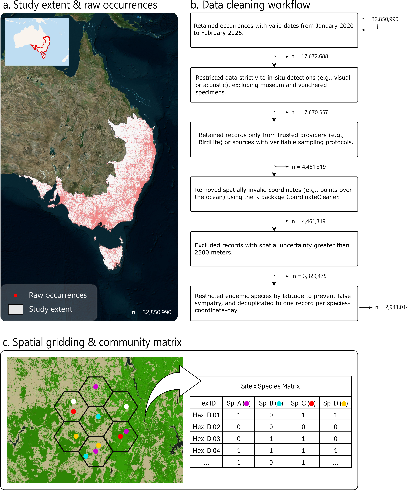
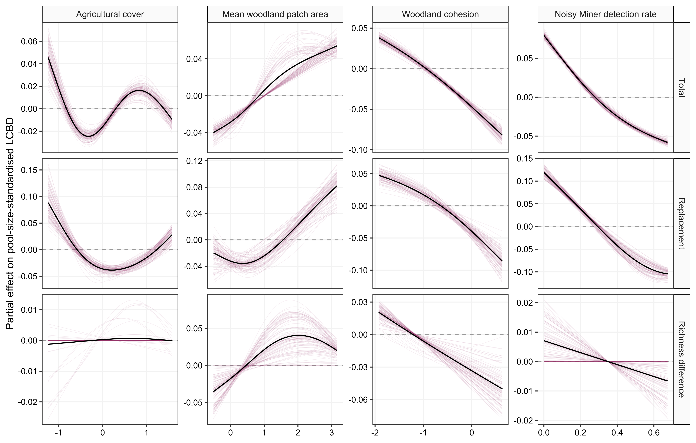
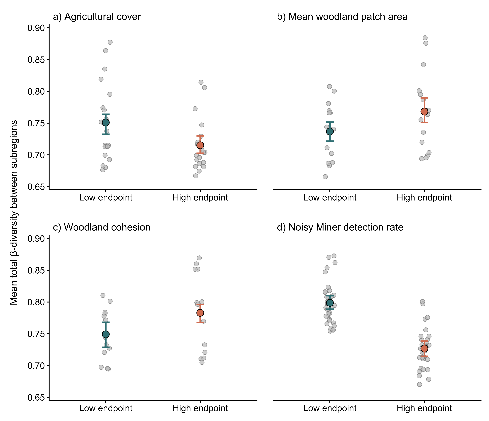
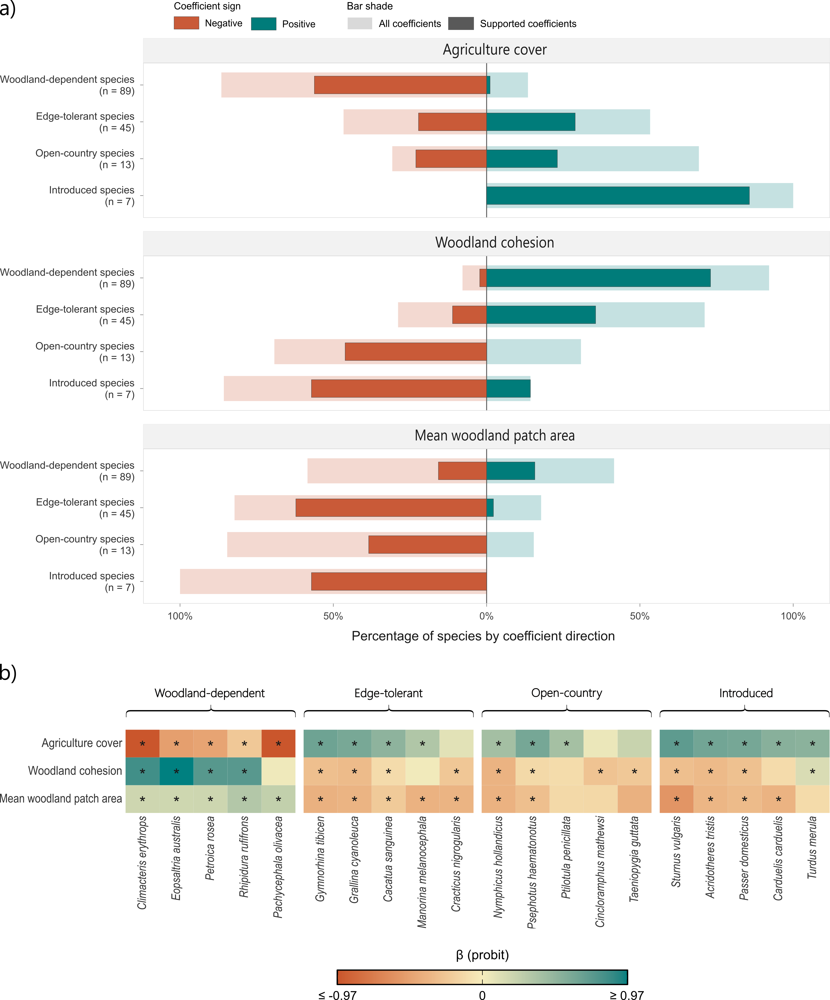
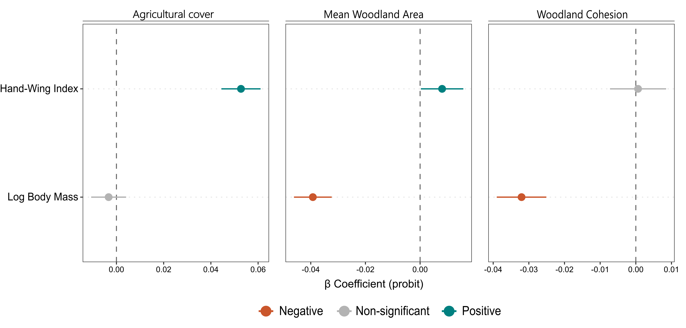

# Landscape modification erodes regional distinctiveness in Australian woodland bird assemblages

**Running title:** Human land use homogenises avifauna across latitudes

**Authors**

Rahil J. Amina,*, Jessie C. Buettelc, Leon A. Barmutaa, and Barry W. Brooka,b

**Author affiliations**

a School of Natural Sciences, University of Tasmania, Private Bag 55, Hobart, Tasmania 7001, Australia

b ARC Centre of Excellence for Australian Biodiversity and Heritage (CABAH), Australia

c Fenner School of Environment and Society, The Australian National University, Acton, Australian Capital Territory 2601, Australia

**Corresponding author**

Rahil Jasminkumar Amin

Email: rahil.amin.biodiversity@gmail.com

## Abstract

**Aim:** By simplifying habitats and facilitating competitive exclusion, human activities can favour a narrow set of disturbance-tolerant species and homogenise assemblages across regions. We tested how landscape modification and the noisy miner, a hypercompetitive native species, reorganised bird assemblages in southeastern Australia, and whether body size and dispersal capacity predicted species responses.

**Location:** Southeast Australia.

**Time period:** January 2020 – February 2026.

**Major taxa studied:** Terrestrial birds

**Methods:** We compiled >32 million citizen-science records for 188 bird species across 2,426 sites. We partitioned Jaccard dissimilarity and modelled local contributions to β-diversity (LCBD) along the disturbance gradients. We then tested convergence in β-diversity among biogeographic regions at low and high endpoints of each gradient. We then used joint species distribution and fourth-corner models to link these spatial signatures to species and morphological traits.

**Results:** Replacement LCBD followed a U-shaped response to agricultural cover, spanning 12.0% between its fitted minimum and maximum. Total LCBD increased by 9.3% from low to high mean woodland patch area, but decreased by 12.0% from low to high woodland cohesion and by 13.8% from low to high noisy miner detection. Between-subregion β-diversity was 0.03–0.07 lower under extensive agriculture, smaller woodland patches, lower woodland cohesion and high noisy miner detection. Agriculture favoured matrix- and edge-adapted, open-country and introduced birds, whereas cohesive woodlands supported more woodland-dependent species. Smaller-bodied species responded more positively to woodland structure, while species with higher hand-wing indices responded more positively to agriculture.

**Main conclusions:** Across a biogeographically heterogeneous avifauna, landscape modification acted as a recurrent ecological filter, consistently favouring disturbance-tolerant taxa over woodland birds. Repeated losses of woodland birds and gains of disturbance-tolerant taxa erode regional compositional distinctiveness and drive biotic homogenisation. By integrating local β-diversity, direct tests of regional convergence and species-level responses, our analysis reveals how local compositional reorganisation scales up to biogeographic homogenisation and which taxa underpin this pattern.

**Keywords:** Community assembly, Ecological filtering, Habitat fragmentation, Landscape configuration, Species turnover

## Introduction

Human activities are reshaping Earth’s ecological communities (Ellis et al., 2010; Newbold et al., 2015). Over 70% of the land surface is now modified, and even the remaining wilderness bears signs of human impact (Barnosky et al., 2012; Kerr et al., 2025). As compounding threats push more taxa towards extinction, this trajectory has come to define the biodiversity crisis (Butchart et al., 2010). Yet biodiversity is multidimensional, and its loss does not unfold uniformly across scales (Hillebrand et al., 2018).

Ecological communities are assembled through dispersal, environmental, and biotic filters (e.g., predation, competition) that dictate which species from the regional pool can reach and persist locally (Chase, 2003; HilleRisLambers et al., 2012). Human activities alter the strength, direction, and spatial extent of these filters (McFadden et al., 2023). For instance, habitat clearing and fragmentation sever movement corridors and isolate populations (Haddad et al., 2015). As the vegetation structure of remnant patches simplifies, species lose foraging and nesting sites, refuges from predators, and the fine-scale habitat structure that supports niche partitioning (Brook et al., 2008). Consequently, these physical changes can then cascade into the species interactions by favouring dominant competitors or introduced predators (Filgueiras et al., 2021). As these filters operate via distinct mechanisms at different scales (Chase et al., 2018), their effects do not leave a single imprint on biodiversity. How then do we trace these multidimensional patterns of biodiversity change?

Ecologists typically achieve this by partitioning regional biodiversity (γ-diversity) into local richness (α-diversity) and compositional turnover among sites (β-diversity) (Anderson et al., 2011; Socolar et al., 2016). Decomposing β-diversity into replacement and richness differences further reveals whether compositional differences arise from species replacement across patches or unequal species richness among sites (Baselga, 2010; Podani & Schmera, 2011). While composite diversity indices quantify spatial and temporal structure, they can conflate processes with opposing conservation implications (e.g., Hillebrand et al., 2018). Declining β-diversity, for example, can reflect successful restoration, as improved connectivity allows dispersal-limited species to recolonise empty patches (Socolar et al., 2016); conversely, it can signal biotic homogenisation, as generalists spread to dominate previously distinct communities (Devictor et al., 2008; Karp et al., 2012). Consequently, high turnover can appear to buffer regional biodiversity while masking the full impact of landscape modification. Gonçalves-Souza et al. (2025) showed that in fragmented landscapes, local extinctions outpace any gain in spatial distinctiveness, inflating β-diversity without increasing γ-diversity. As these spatial patterns reflect which taxa are lost, retained, or replaced, composite indices must be complemented with approaches that identify the winners and losers in modified landscapes (Filgueiras et al., 2021; Newbold et al., 2018).

Joint species distribution models (JSDMs) retain the taxonomic detail that composite indices aggregate (Ovaskainen & Abrego, 2020; Ovaskainen et al., 2017). By estimating multiple species responses jointly, they identify which taxa increase or decrease along shared environmental gradients (Pollock et al., 2014). Fourth-corner analysis extends JSDMs to test whether species responses are structured by attributes such as body size or dispersal capacity (Griffin et al., 2025; Pichler & Hartig, 2021). Thus, where partitioned β-diversity maps the geography of compositional change, JSDMs identify the species and traits underlying these patterns. Together, they can identify the taxonomic and trait structure underlying landscape-driven compositional change.

We apply both approaches to decompose spatial biodiversity patterns in bird assemblages across southeastern Australia's temperate woodlands. Decades of clearing in this region have reduced intact woodlands to isolated remnants embedded in agricultural matrices (Bradshaw, 2012; Yates & Hobbs, 1998). In these fragments, thinning understoreys and proliferating edges favour the noisy miner (Manorina melanocephala), a cooperatively breeding native honeyeater that, at high densities, excludes birds through sustained mobbing (Crates et al., 2023; Lindenmayer et al., 2023; Mac Nally et al., 2012; Maron et al., 2013; Val et al., 2018). This combination of landscape clearing, structural simplification and aggressive biotic exclusion has contributed to severe declines among woodland specialists, leaving remnants with locally depauperate assemblages (Ford, 2011; Watson et al., 2002). If such filtering mechanisms recur across the seaboard, assemblages from biogeographically distinct regions may converge towards similar sets of disturbance-tolerant taxa.

Here, we draw on extensive occurrence data spanning southeastern Australia to test whether landscape modification homogenises bird assemblages across latitudes that would otherwise support distinct taxa. We first partition β-diversity to determine how local compositional uniqueness changes along landscape and noisy miner gradients. We then test whether these local changes scale up to regional convergence by comparing bird assemblages among IBRA subregions at contrasting ends of disturbance gradients. Finally, we use trait-extended JSDMs to identify the species and morphological traits associated with community reorganisation. We predict that woodland bird assemblages from different subregions will become more compositionally similar towards the modified ends of these gradients. We further expect species replacement to be greatest at land-use extremes, reflecting the distinctiveness of woodland specialists in intact landscapes and disturbance-tolerant taxa in modified landscapes. Finally, we expect these spatial patterns to carry distinct trait signatures, with large, connected woodlands supporting smaller-bodied species, and agricultural matrices favouring species with greater dispersal capacity.

## Methods

### Spatial framework and data processing

We focused on 188 land-bird species across southeastern Australia, spanning a range of body sizes, habitat preferences, and conservation statuses (Table S1). The spatial extent covered 162 Interim Biogeographic Regionalisation for Australia (IBRA) subregions encompassing both intact woodlands and forests, and converted landscapes (Figure 1a, Table S2). We sourced occurrence data from the Atlas of Living Australia (ALA) using the R package galah (Westgate et al., 2026). We retained records from January 2020 to February 2026 with valid dates, coordinates and species names to capture contemporary distributions while limiting temporal mismatch with the 2023 landscape data (c.f., landscape predictors section).

We then applied multi-stage quality filters (Figure 1b, Table S3). First, we kept only in-situ detections (e.g., visual, acoustic, camera-trap records), excluding museum specimens and other vouchered records. We then retained only presences and removed records with unsuitable sampling protocols (e.g., recorded from a moving vehicle). Records without protocol information were retained only from sources with established validation procedures, including eBird Australia, BirdLife Australia, and state biodiversity atlases. We then used the CoordinateCleaner package in R (Zizka et al., 2019) to remove spatially spurious points (e.g., records located over the ocean). We excluded records with reported coordinate uncertainty above 2500 m to match the 2.5 km analytical grain (see next paragraph) and reduce positional uncertainty (Moudrý et al., 2024). Records without reported coordinate uncertainty were retained only when they came from explicitly standardised protocols, such as camera trapping, stationary counts, transects, and fixed area searches. To prevent false sympatry, non-migratory Tasmanian endemics were restricted to records south of 39.5°S and mainland-restricted species to records north of this latitude. We deduplicated to one record per species–coordinate–day. The final dataset comprised more than 2.9 million records for 188 species. Given that records spanned opportunistic and structured surveys, we compared prevalence matrices to test whether sampling design altered species rankings. Rankings were stable, with common species remaining common and rare species remaining rare (Figure S1).

We generated a regular hexagonal grid in Australian Albers (EPSG:3577) covering the study extent using the sf package (Pebesma, 2018), with 2.5 km between opposite edges and an area of approximately 5.41 km² per complete hexagon. Records were first converted to point geometries, transformed to the coordinate reference system of the hexagons, and spatially joined to the intersecting hexagon (Figure 1c). This resulted in 44,292 hexagons with species records. Thereon, each occupied hexagon was treated as a local community and used as the site unit for downstream community analyses. We chose this grain size as it balanced local community resolution against the uneven structure of opportunistic occurrence data. Finer grains divided records across many sampled sites, producing sparse community matrices. Coarser grains merged distinct assemblages and obscured landscape-level community structure (Wang et al., 2014).

### Reducing bias from incomplete samples

Citizen-science data often contain incomplete samples due to uneven sampling, biasing estimates of community composition (Callaghan et al., 2019; Isaac et al., 2014). To reduce this bias, we estimated sampling completeness for each hexagon as the ratio between observed richness and incidence-based Chao2 richness calculated using the iNEXT package (Chao, 1987; Hsieh et al., 2016). Given the size of the dataset, calculating bootstrapped standard errors for every hexagon was computationally prohibitive. Completeness served as a filtering criterion rather than a direct estimand, so we used point estimates only.

For each hexagon, species detection frequency was defined as the number of unique month–year combinations in which a species was recorded (see Callaghan et al. 2019). We used month-year as the sampling unit to retain temporal replication while limiting duplication from individual visits or short sampling bursts. Completeness was calculated as:

$$
C_h = \frac{S_{\mathrm{obs},h}}{\widehat{S}_{\mathrm{Chao2},h}}
$$

where $S_{\mathrm{obs},h}$ is the observed richness in hexagon $h$ and $\widehat{S}_{\mathrm{Chao2},h}$ is the Chao2 estimate.

We retained hexagons with ≥70% completeness, ≥6 unique month-year incidence units, and ≥5 recorded species. These thresholds collectively balanced spatial coverage against undersampling (Prenda et al., 2024), increased temporal coverage to avoid phenological biases (Callaghan et al., 2019), and removed hexagons with too few recorded species for stable site-wise variance in β-diversity estimates (Duflot & Vähätalo, 2024). These filters retained 5,189 hexagons and 188 species for the community matrix.

We tested alternative completeness thresholds of 75–90%, a minimum of 12 sampled months, daily incidence units, structured protocols only, and 20 or 30 reference pools. Sampling, incidence-unit and protocol alternatives were evaluated using both LCBD and regional-convergence analyses, whereas reference-pool alternatives were evaluated using LCBD only (Table S4).

### Landscape predictors

We derived spatial predictors from the National Vegetation Information System (NVIS v7.0 [2023], 30 m; www.dcceew.gov.au), and catchment-scale land-use mapping (CLUM v2 [2023], 50 m; www.agriculture.gov.au). To limit overfitting, we reclassified vegetation into four broad structural categories: (1) wet dense forest; (2) sclerophyll forest and woodland; (3) mallee and arid woodland; and (4) non-woodland (grasslands, shrublands, and bare soils). We reclassified the land-use raster into five broad categories: (1) conservation and other minimal use; (2) production from native vegetation; (3) plantation forests; (4) agriculture; and (5) urban area and other intensive use (see Figure S2 for full crosswalk). These categories captured the key structural gradients with known impacts on southeastern Australian woodland avifauna (Lindenmayer, 2022).

Using the R package landscapemetrics (Hesselbarth et al., 2019), we calculated proportional cover of each vegetation and land-use class within a circular 2.5 km-radius window centred on each hexagon centroid. The window therefore extended beyond the focal hexagon and could overlap neighbouring windows. Metrics were calculated independently for each centroid, and overlapping windows were retained rather than merged. To separate habitat amount from configuration (Fahrig, 2013), we combined wet dense forest, sclerophyll forest and woodland, and mallee and arid woodland into a single class before calculating mean woodland patch area and cohesion. To restrict inference to predominantly non-urban landscapes, we retained hexagons with no more than 10% urban and other intensive land use. We also required complete values for all ten selected landscape metrics before preparing the model data. These filters resulted in 2,426 hexagons for modelling. Among the retained predictors, all pairwise Pearson correlations had < 0.7, and variance inflation factors were < 5 (Figure S3 and Table S5). All continuous landscape predictors were scaled and centred before modelling.

### Noisy miner detection rate

For each retained hexagon, we defined sampling units using the same month–year incidence-unit definition as the Chao2 analysis. Noisy miner detection rate was the proportion of these units containing at least one noisy miner record. The denominator therefore included every month–year unit with at least one retained bird record, and hexagons without noisy miner records received a detection rate of zero. We included noisy miner detection rate as a hexagon-level predictor in the β-diversity analyses, matching the spatial scale of the community response. To avoid part–whole coupling, we excluded the noisy miner from the β-diversity matrix. We tested whether the association persisted after accounting for landscape, effort, spatial and broad IBRA effects by modelling noisy miner detection counts and using the deviance residuals as a residualised predictor in the LCBD models (Figure S4).

### Local contributions to β-diversity and its components

We treated each retained hexagon as a site and calculated pairwise Jaccard dissimilarity among sites. We partitioned each pairwise dissimilarity into species replacement and richness-difference components using the Podani framework (Podani & Schmera, 2011). Replacement captures differences in species identities, whereas richness difference captures differences in the number of species between sites. Pairwise dissimilarities were computed once from the full community matrix. The dissimilarity between any two sites therefore always reflected the same species identities.

We quantified each site's compositional deviation within its geographical reference pool (hereafter ‘reference pool’) using local contributions to β-diversity (LCBD), calculated with R package adespatial (Dray et al., 2018; Legendre & De Cáceres, 2013). Given that LCBD is defined relative to the sites included in its reference pool, calculating LCBD across the full study extent would conflate landscape-driven reorganisation with broad biogeographic turnover. We therefore grouped sites into geographical reference pools by applying k-means clustering to projected representative-point coordinates for each hexagon. Each k-means cluster defined one reference pool. Within each pool, we calculated LCBD separately for total β-diversity, species replacement and richness difference, after square-root transformation of the corresponding dissimilarities. Each allocation repeated the clustering with a different random seed and was independent of IBRA boundaries.

For each β-diversity component, raw LCBD values sum to one within each reference pool, so their expected magnitude decreases mechanically as the number of sites in a pool increases. We removed this dependence by standardising each site's contribution to the reference pool as:

$$
\mathrm{rLCBD}_{ij} = n_j\,\mathrm{LCBD}_{ij}
$$

where $n_j$ is the number of sites in reference pool $j$. Pool-size-standardised LCBD therefore has an expected mean of one within every reference pool. Values above one indicate sites contributing more than the equal-contribution expectation to compositional variation within their pool, whereas values below one indicate smaller contributions.

Given that our analysis tested responses along environmental gradients, a pool also needed sufficient coverage of the focal predictor. For each predictor separately, we retained pools containing at least five sites below the study-wide 25th percentile and five above or at the 75th percentile. These thresholds were fixed across geographical allocations. Once a pool qualified, all of its sites were retained, including those at intermediate predictor values. Thus, predictor coverage determined whether a regional pool contributed to an analysis but did not alter the assemblages used to calculate LCBD. We required reference pools to contain at least 30 hexagons. Each gradient-specific model required at least five informative pools. As reference pool definition can affect LCBD values, we repeated the full modelling workflow across 100 clustering iterations with different random seeds. We used k = 25 for the main analysis and tested k = 20 and k = 30 with 30 allocations per scenario, using the same seeds across scenarios and refitting the main settings with 30 allocations (Figures S5-S8).

### Modelling LCBD responses

We modelled pool-size-standardised LCBD using generalised additive mixed models (GAMMs) with Gaussian errors via the R package mgcv (Wood & Wood, 2015). We fitted separate models for total, replacement, and richness-difference LCBD. Here, i indexed hexagons and j indexed the k-means reference pool to which each hexagon was assigned. For hexagon i in reference pool j, yij denoted the pool-size-standardised LCBD and µij denoted its expected value. We specified the model as:

$$
\begin{aligned}
y_{ij} &\sim \mathrm{N}(\mu_{ij},\sigma^2),\\
\mu_{ij} &= \beta_0 + \beta_1\log(\mathrm{effort}_i)
  + \sum_{k=1}^{K} f_k(X_{ki}) + f_{\mathrm{gp}}(x_i,y_i) + \gamma_j,\\
\gamma_j &\sim \mathrm{N}(0,\sigma_\gamma^2).
\end{aligned}
$$

where β0 denoted the global intercept, β1 denoted the effect of sampling effort, measured as the natural logarithm of the number of sampled month–year units, and γ_j denoted the random intercept for the k-means reference pool j. Xki denoted the kth landscape predictor, fitted as a penalised thin-plate regression spline (basis dimension k’ = 5) with shrinkage-based selection. We added an isotropic Gaussian-process smooth over the projected coordinates of a representative point on each hexagon (k’ = 50) to account for residual spatial autocorrelation, alongside the reference-pool random intercept. Models were fitted with Gaussian errors, an identity link, fast restricted maximum likelihood and shrinkage-based term selection. During exploratory model fitting, we assessed the pairwise concurvity and removed terms that could not be estimated independently of non-linear effects, including interactions between gradients. The selected model included separate penalised thin-plate regression splines for agricultural cover, mean woodland patch area, woodland cohesion and noisy miner rate.

We then fitted the specified model across all 100 geographical allocations and summarised response curves across iterations, incorporating both model uncertainty and variation arising from reference-pool allocation. We summarised endpoint changes and full fitted ranges by their medians across allocations, expressing both as percentages of the within-pool mean LCBD (Table S6). Prediction ranges were restricted to the overlap of the 5th and 95th percentile ranges across allocations. Using the first geographical allocation, we compared the matched LCBD models with and without the spatial smooth, retaining reference-pool random intercepts. We assessed spatial structure in the Pearson residuals using Moran's I correlograms in 2.5 km distance bands up to 25 km (Dormann et al., 2007). Spatial smoothing reduced, but did not eliminate, residual autocorrelation in the LCBD models (Figure S9).

### Regional convergence across landscape gradients

To test whether local compositional change scaled up to biogeographic convergence, we compared β-diversity among IBRA subregions at contrasting ends of agricultural cover, noisy miner detection rate, woodland cohesion and mean woodland patch area. Agricultural endpoints comprised sites with <20% and >80% agricultural cover, while mean woodland patch area, woodland cohesion and noisy miner detection were represented by the values at or below the study-wide 20th percentile and at or above the 80th percentile. Each gradient was analysed independently, retaining subregions represented by at least three sites at both endpoints. We required at least four qualifying IBRA subregions for each gradient comparison. We calculated total Jaccard dissimilarity between all pairs of sites belonging to different retained subregions and averaged these values within each pair of subregions. We then averaged across subregion pairs to estimate between-subregion β-diversity at each endpoint, giving each pair equal weight. Uncertainty in endpoint contrasts was estimated from 99 bootstrap resamples, drawing sites with replacement separately within each retained IBRA subregion and endpoint. Lower between-subregion β-diversity therefore indicated greater compositional similarity among subregions. We repeated these comparisons under the alternative sampling criteria (Figure S10).

### Joint species distribution models

We fitted a generalised linear latent variable model (GLLVM) with a binomial distribution and probit link using the R package gllvm (Niku et al., 2019). The environmental model estimated species-specific responses to agricultural cover, woodland cohesion and mean woodland patch area. We excluded noisy miner detection rate and instead included noisy miner as a response species. The model also included the natural logarithm of the number of sampled month–year units as an effort covariate with species-specific coefficients, allowing the association between sampling effort and recorded occurrence to vary among species. IBRA subregions were used as row-level random intercepts, and an unconstrained latent variable captured residual correlations unexplained by the measured environment, spatial, and regional structure.

To absorb residual spatial structure, we generated positive distance-based Moran's eigenvector maps (dbMEMs; Dray et al., 2006) from projected site coordinates and tested their joint association with the Hellinger-transformed community matrix using redundancy analysis (Legendre & Gallagher, 2001). When the global test was significant at α = 0.05, we performed forward selection using α = 0.01, 199 permutations and the adjusted R² of the global model as a ceiling (Blanchet et al., 2008). The selected dbMEMs were included as fixed effects in both environmental and fourth-corner GLLVMs. To reduce convergence problems with sparse response vectors, we restricted the analysis to species occurring in ≥ 2% of the retained hexagons, leaving 154 species.

The fourth-corner model tested whether responses to landscape structure varied with body mass and hand-wing index (HWI). These morphological data were obtained from the AVONET database (Tobias et al., 2022). We used body mass to capture life-history variation associated with within-patch structural filtering, and HWI as a proxy for dispersal capacity across fragmented matrices (Sheard et al., 2020). Species lacking either trait were excluded after the final occupancy filter. Body mass was log-transformed, and both log body mass and HWI were centred and scaled before modelling.

The fourth-corner model included interactions between each trait and the three landscape predictors: agriculture cover, woodland cohesion and mean woodland patch area. Log effort and selected dbMEMs were retained as additive fixed effects, while IBRA subregions remained as row-level random intercepts. We fitted the model without latent variables to focus inference on trait-structured environmental responses. As both body mass and HWI are phylogenetically structured, we interpreted their effects as trait associations rather than independent evolutionary effects. We assessed residual behaviour using Dunn-Smyth diagnostic plots (Figure S11). We also evaluated the contribution of dbMEMs to spatial control by comparing species-specific residual Moran's I between environmental GLLVMs fitted with and without dbMEMs (Figure S12; Table S7). While dbMEMs removed detectable positive residual spatial autocorrelation from the environmental model across the tested distances, some residual structure remained in the fourth-corner models (Figure S13).

## Results

### Spatial signature of community reorganisation

Landscape gradients and noisy miner detection shaped pool-size-standardised site-level uniqueness, but responses differed among β-diversity components (Figure 2; Table S6). Total LCBD increased by 9.3% from the lower to the upper end of the mean woodland patch-area gradient. Across the same gradient, replacement declined initially before increasing, spanning 12.6% across the fitted curve, while richness differences were hump-shaped and spanned 7.1%. By contrast, total, replacement and richness-difference LCBD declined by 12.0%, 13.3% and 7.4%, respectively, from low to high woodland cohesion.

Responses to agricultural cover were nonlinear. Replacement followed a U-shaped response spanning 12.0%, total LCBD varied by 7.0%, and richness differences changed little. LCBD declined more consistently with increasing noisy miner detection: total LCBD declined by 13.8%, replacement by 22.2%, and richness differences by 1.3% (Figure 2; Table S6). The agricultural replacement curve remained U-shaped under alternative effort, incidence-unit and reference-pool definitions but weakened at 75–80% completeness (Figures S5-S8). Declines in total and replacement LCBD with increasing noisy miner detection persisted after residualisation (Figure S4).

### Regional convergence across landscape gradients

Mean total β-diversity between IBRA subregions was lower under greater agricultural cover, smaller woodland patches, lower woodland cohesion and higher noisy miner detection (Figure 3). Mean total β-diversity declined from 0.75 to 0.72 with increasing agricultural cover (Δβ_total = −0.04, 95% CI = −0.05 to −0.01, Figure 3a). Smaller woodland patches also had lower mean total β-diversity than larger patches (0.74 versus 0.77, Δβ_total = −0.03, 95% CI = −0.06 to −0.01, Figure 3b). Mean total β-diversity was similarly lower under low than high woodland cohesion (0.75 versus 0.78, Δβ_total = −0.03, 95% CI = −0.06 to −0.01, Figure 3c). Increasing noisy miner detection was associated with the strongest decline, from 0.80 to 0.73 (Δβ_total = −0.07, 95% CI = −0.09 to −0.06, Figure 3d). Regional convergence was generally retained across sensitivity analyses, although some trends weakened under stricter sampling filters. The noisy miner association persisted across all estimable scenarios (Figure S10).

### Species-level responses to habitat modification

Of the 154 species analysed in the JSDMs, supported occurrence responses to the three landscape gradients differed among ecological groups (Figure 4a; Figure S14). Supported responses were most common for woodland cohesion (99/154), followed by agricultural cover (86/154) and patch area (66/154). Occurrence declined with increasing agricultural cover for 63 species and increased for 23. Most declining species were woodland-dependent birds (n = 50; Figure 4a), such as the red-browed treecreeper (Climacteris erythrops), olive whistler (Pachycephala olivacea), and eastern yellow robin (Eopsaltria australis) (Figure 4b). Ten matrix- and edge-adapted native birds also declined. Of the 23 species that increased, 22 were matrix- and edge-adapted, open-country or introduced birds (Figure 4a). These included the noisy miner, open-country birds (red-rumped parrot Psephotus haematonotus), and six introduced species, including common starling (Sturnus vulgaris), house sparrow (Passer domesticus) and common myna (Acridotheres tristis) (Figure 4a, 4b and Figure S14).

Occurrence increased with woodland cohesion for 82 species and declined for 17. Most species that increased with cohesion were woodland-dependent birds (n = 65), alongside 16 matrix and edge natives (Figure 4a). Woodland specialists responding positively with woodland cohesion included the red-browed treecreeper, rose robin (Petroica rosea), eastern yellow robin, and rufous fantail (Rhipidura rufifrons) (Figure 4b). In contrast, open-country birds, such as the zebra finch (Taeniopygia guttata), and introduced birds declined (Figure 4a, 4b and Figure S14).

Responses to mean woodland patch area were less common: occurrence declined for 51 species and increased for 15. Declines spanned ecological groups, primarily matrix and edge natives (n = 28; Figure 4a), but also 14 woodland-dependent, five open-country and four introduced species (Figure 4a). Most species that increased with patch area were woodland-dependent (n = 14; Figure 4a), such as the olive whistler, rose robin, eastern yellow robin, and rufous fantail (Figure 4b). The noisy miner declined with increasing patch area but showed no support for woodland cohesion (Figure 4b).

### Trait signatures of species responses

Smaller-bodied species responded more positively than larger-bodied species to increasing mean woodland patch area and woodland cohesion, but body size did not structure responses to agricultural cover (Figure 5). Species with higher hand-wing indices responded more positively to agricultural cover and, more weakly, to mean woodland patch area, but showed no supported association with woodland cohesion (Figure 5).

## Discussion

Across nearly 2,400 sites along Australia’s eastern seaboard, landscape modification reorganised bird assemblages from local to biogeographic scales. Species replacement followed a nonlinear response to agricultural cover, while β-diversity between IBRA subregions was lower under extensive agriculture, smaller woodland patches, lower woodland cohesion and high noisy miner detection. Local compositional uniqueness also declined consistently with noisy miner detection. JSDMs traced this landscape shift to gains among matrix- and edge-adapted, open-country and introduced birds and widespread declines among woodland-dependent species. Fourth-corner analyses linked species responses to body size and dispersal capacity.

Larger woodland patches were associated with greater local compositional uniqueness. By increasing the ratio of interior to edge habitat, larger patches can buffer woodland specialists from altered microclimates and other edge effects (Ewers & Didham, 2007; Fletcher Jr et al., 2018). Smaller patches instead favour birds able to exploit both woodland and the surrounding matrix. Our findings corroborate regional studies showing that patch area and vegetation structure jointly shape woodland-bird assemblages, with specialists declining in smaller, edge-dominated remnants (Ikin et al., 2014; J. Watson et al., 2002). Interestingly, woodland-dependent birds showed mixed responses to patch area. This may partly stem from our 2% occupancy threshold, which excluded rare woodland specialists most dependent on patch interiors. Habitat condition may also shape these responses, as even large patches lose value when structural simplification removes understorey cover, mature eucalypts and key foraging and nesting substrates (Ford et al., 2009; Watson et al., 2005).

Increasing woodland cohesion reduced species replacement and richness differences while favouring woodland-dependent birds. Lower richness-difference likely reflect the retention of woodland taxa rather than convergence on uniformly species-poor assemblages. Continuous woodland facilitates access to spatially dispersed resources and source populations by reducing the movement and foraging costs imposed by even short cleared gaps (Robertson & Radford, 2009). This access can promote demographic rescue and maintain local occupancy. For instance, habitat amount has influenced more species than structural connectivity in other regional studies (Fahrig, 2013; Lindenmayer et al., 2020; Radford & Bennett, 2007). This contrast may partly reflect the cohesion index itself, which captures proportional woodland cover as well as aggregation (Didham et al., 2012; Fletcher Jr et al., 2018; Hesselbarth et al., 2019). The positive response of smaller-bodied species concurs with studies showing that connected woodlands support greater small-bird richness when they retain dense shrub cover and fine-scale structural complexity (Val et al., 2018). The cohesion response may therefore arise from the joint effects of woodland amount and continuity, while the surrounding matrix determines the permeability of intervening gaps (Driscoll et al., 2013).

The agricultural matrix compounds these structural filters by reducing habitat availability and impeding movement among woodland patches. Replacement LCBD declined towards intermediate agricultural cover before increasing again under extensive agriculture, consistent with a shift from woodland-dominated assemblages towards disturbance-tolerant taxa. Conversion expands foraging habitat for granivores and other open-country species while removing the cover and substrates required by woodland taxa (Filgueiras et al., 2021; Newbold et al., 2018). Loss of woody cover also increases functional isolation by widening the gaps between woodland patches. Brown treecreepers (Climacteris picumnus), for example, use scattered paddock trees as stepping stones but seldom cross wide gaps in tree cover, leaving isolated populations vulnerable to extirpation (Doerr et al., 2011). We found that species with higher hand-wing indices responded more positively to agricultural cover, suggesting that gap-crossing ability helped structure this turnover. Agricultural conversion therefore filters the regional species pool towards birds able to exploit and traverse farmland.

Among these birds is the noisy miner, whose occurrence increased with agricultural cover and declined with woodland patch area. This profile accords with its preference for edge-dominated woodland, where clearing and grazing maintain open vegetation and sparse understorey (Howes et al., 2014; Mac Nally et al., 2012; Maron et al., 2013). In such landscapes, noisy miner densities can exceed 0.6 birds ha⁻¹, above which sustained mobbing can sharply reduce the richness and abundance of smaller birds (Crates et al., 2023; Maron et al., 2013). At the landscape scale, local compositional uniqueness generally declined with miner detection. Although territorial exclusion occurs below our 2.5-km grain, the compositional signature observed across modified landscapes spanning the eastern seaboard is consistent with its cumulative effects (Montague-Drake et al., 2011). Pied butcherbirds were also more likely to occur in landscapes with smaller woodland patches. These conditions may intensify declines among small woodland birds where noisy miners are also abundant (Westgate et al., 2021). Land use may therefore amplify environmental filtering by favouring taxa that strengthen biotic exclusion (Côté et al., 2016).

The recurrence of these patterns across Australia’s eastern seaboard indicates that land use imposes a common filter on regional avifauna. As land use fragments woodlands, edges expose more core woodland to this anthropogenic filter, where specialists decline while generalists proliferate. Across these broad biogeographical gradients, compositional differentiation among IBRA subregions was consistently lower under modified conditions, with the strongest convergence occurring where noisy miner detection was high. This regional convergence reflects a broader biogeographic signature of land-use change. In fact, land use drives the homogenisation beyond Australia, reducing avian community specialisation across biogeographical zones and replacing range-restricted species with widespread taxa globally (Devictor et al., 2008; Ellis et al., 2026; Newbold et al., 2018). Gains of widespread taxa might therefore offset specialist losses within local assemblages, masking continued erosion of regional distinctiveness (Gossner et al., 2016).

These filters leave a complex imprint on community structure. The convergence of agricultural assemblages among IBRA subregions is consistent with evidence that intensive agriculture erodes avian β-diversity at large spatial scales (Karp et al. 2012). In our analysis, high replacement LCBD at both low and high agricultural cover indicated locally distinctive assemblages within their reference pools. Local compositional uniqueness can therefore coexist with regional homogenisation, reinforcing the need to interpret β-diversity in its spatial and ecological context (Socolar et al. 2016). Increasing woodland cohesion instead reduced richness-difference LCBD while favouring woodland birds. Pairing LCBD with direct regional comparisons therefore distinguishes local compositional uniqueness from biogeographic convergence, while JSDMs identify the species and traits underlying both patterns.

Despite our efforts to account for them, some methodological caveats remain. Citizen-science data carry spatial and taxonomic biases, often underrepresenting cryptic ground birds and assemblages in poorly sampled habitat interiors. We reduced these biases using completeness thresholds (Callaghan et al., 2022), effort covariates and spatial controls, but inference remains strongest in well-sampled regions. LCBD presents a separate challenge because it measures each assemblage relative to the centroid of its reference pool. We built each pool from regional neighbours and retained coverage of the focal gradient, avoiding comparisons across distant biogeographical regions. Even so, directional compositional change can place assemblages at both ends of a gradient furthest from the centroid and generate a U-shaped LCBD curve (Hernández‐Carrasco et al., 2026). Our U-shaped replacement curves therefore show endpoint distinctiveness, not peaks in turnover rate. Finally, cross-sectional data cannot determine whether the spatial convergence observed here will intensify, reverse or lead to further compositional erosion through time. Temporal data are needed to resolve these trajectories. Nevertheless, the recurrence of taxonomic and trait signatures across broad geographic gradients suggests that sampling bias alone does not explain the principal patterns.

## Conclusion

Human land use simplifies bird assemblages across broad biogeographical gradients of southeastern Australia. By filtering assemblages towards disturbance-tolerant taxa, landscape modification may narrow the range of ecological strategies available for post-disturbance reassembly. Drier conditions from climate change may compound this filtering by favouring birds already able to exploit open agricultural matrices, while contracting climatically suitable habitat for woodland specialists and forcing range shifting to track suitable conditions (Frishkoff et al., 2016). Moreover, these pressures will likely be acute after catastrophes such as megafires, when recovery depends on which species persist in surrounding landscapes and can recolonise disturbed habitat. Promoting this recovery thus requires conservation networks that protect large, connected woodlands and restore understorey cover and habitat complexity. Green corridors can support movement through agricultural matrices, but only where they retain the cover and resources sensitive species require. Meeting area-based targets under the Kunming–Montreal Global Biodiversity Framework therefore requires more than securing hectares (Pillay et al., 2024). A key first step is identifying where protection is most urgent and which taxa are most vulnerable, requiring a macroecological lens that links spatial patterns to species responses. By pairing partitioned β-diversity with direct tests of regional convergence and trait-extended JSDMs, we distinguish landscapes that retain regionally distinctive woodland assemblages from those converging on disturbance-tolerant taxa. While these models map the current winners and losers of landscape modification, temporal data remain essential to determine whether management restores woodland assemblages or biotic homogenisation persists. Ultimately, conservation success depends not simply on habitat extent, but on whether protected networks sustain the regional species pools from which diverse woodland avifauna can recover.

## References

Anderson, M. J., Crist, T. O., Chase, J. M., Vellend, M., Inouye, B. D., Freestone, A. L., . . . Davies, K. F. (2011). Navigating the multiple meanings of β diversity: a roadmap for the practicing ecologist. Ecology Letters, 14(1), 19–28.

Barnosky, A. D., Hadly, E. A., Bascompte, J., Berlow, E. L., Brown, J. H., Fortelius, M., . . . Marquet, P. A. (2012). Approaching a state shift in Earth’s biosphere. Nature, 486(7401), 52–58.

Baselga, A. (2010). Partitioning the turnover and nestedness components of beta diversity. Global Ecology and Biogeography, 19(1), 134–143.

Blanchet, F. G., Legendre, P., & Borcard, D. (2008). Forward selection of explanatory variables. Ecology, 89(9), 2623–2632.

Bradshaw, C. J. (2012). Little left to lose: deforestation and forest degradation in Australia since European colonization. Journal of Plant Ecology, 5(1), 109–120.

Brook, B. W., Sodhi, N. S., & Bradshaw, C. J. (2008). Synergies among extinction drivers under global change. Trends in Ecology & Evolution, 23(8), 453–460.

Butchart, S. H., Walpole, M., Collen, B., Van Strien, A., Scharlemann, J. P., Almond, R. E., . . . Bruno, J. (2010). Global biodiversity: indicators of recent declines. Science, 328(5982), 1164–1168.

Callaghan, C. T., Bowler, D. E., Blowes, S. A., Chase, J. M., Lyons, M. B., & Pereira, H. M. (2022). Quantifying effort needed to estimate species diversity from citizen science data. Ecosphere, 13(4), e3966.

Callaghan, C. T., Poore, A. G., Major, R. E., Rowley, J. J., & Cornwell, W. K. (2019). Optimizing future biodiversity sampling by citizen scientists. Proceedings of the Royal Society B: Biological Sciences, 286(1912).

Chao, A. (1987). Estimating the population size for capture-recapture data with unequal catchability. Biometrics, 783–791.

Chase, J. M. (2003). Community assembly: when should history matter? Oecologia, 136(4), 489–498.

Chase, J. M., McGill, B. J., McGlinn, D. J., May, F., Blowes, S. A., Xiao, X., . . . Gotelli, N. J. (2018). Embracing scale‐dependence to achieve a deeper understanding of biodiversity and its change across communities. Ecology Letters, 21(11), 1737–1751.

Côté, I. M., Darling, E. S., & Brown, C. J. (2016). Interactions among ecosystem stressors and their importance in conservation. Proceedings of the Royal Society B: Biological Sciences, 283(1824).

Crates, R., McDonald, P. G., Melton, C. B., Maron, M., Ingwersen, D., Mowat, E., . . . Heinsohn, R. (2023). Towards effective management of an overabundant native bird: The noisy miner. Conservation Science and Practice, 5(2), e12875.

Devictor, V., Julliard, R., & Jiguet, F. (2008). Distribution of specialist and generalist species along spatial gradients of habitat disturbance and fragmentation. Oikos, 117(4), 507–514.

Didham, R. K., Kapos, V., & Ewers, R. M. (2012). Rethinking the conceptual foundations of habitat fragmentation research. Oikos, 121(2), 161–170.

Doerr, V. A., Doerr, E. D., & Davies, M. J. (2011). Dispersal behaviour of Brown Treecreepers predicts functional connectivity for several other woodland birds. Emu, 111(1), 71–83.

Dormann, C. F., McPherson, J. M., Araújo, M. B., Bivand, R., Bolliger, J., Carl, G., . . . Kissling, W. D. (2007). Methods to account for spatial autocorrelation in the analysis of species distributional data: a review. Ecography, 609–628.

Dray, S., Blanchet, G., Borcard, D., Guenard, G., Jombart, T., Larocque, G., . . . Dray, M. S. (2018). Package ‘adespatial’. R package, 2018, 3–8.

Dray, S., Legendre, P., & Peres-Neto, P. R. (2006). Spatial modelling: a comprehensive framework for principal coordinate analysis of neighbour matrices (PCNM). Ecological Modelling, 196(3-4), 483–493.

Driscoll, D. A., Banks, S. C., Barton, P. S., Lindenmayer, D. B., & Smith, A. L. (2013). Conceptual domain of the matrix in fragmented landscapes. Trends in Ecology & Evolution, 28(10), 605–613.

Duflot, R., & Vähätalo, A. V. (2024). Identifying sites with high biodiversity value using filtered species records from a biodiversity information facility. Diversity and Distributions, 30(10), e13864.

Ellis, E. C., Klein Goldewijk, K., Siebert, S., Lightman, D., & Ramankutty, N. (2010). Anthropogenic transformation of the biomes, 1700 to 2000. Global Ecology and Biogeography, 19(5), 589–606.

Ellis, M., Carrasco, L., Castillo, F., de Aguilar, J. R., Ferguson, E., Gil, C. A. P., . . . Karubian, J. (2026). Biotic homogenization and differentiation effects of fragmentation vary with spatial scale for multiple levels of understory bird diversity in northwest Ecuador. Landscape Ecology, 41(3), 60.

Ewers, R. M., & Didham, R. K. (2007). The effect of fragment shape and species' sensitivity to habitat edges on animal population size. Conservation biology, 21(4), 926–936.

Fahrig, L. (2013). Rethinking patch size and isolation effects: the habitat amount hypothesis. Journal of Biogeography, 40(9), 1649–1663.

Filgueiras, B. K., Peres, C. A., Melo, F. P., Leal, I. R., & Tabarelli, M. (2021). Winner–loser species replacements in human-modified landscapes. Trends in Ecology & Evolution, 36(6), 545–555.

Fletcher Jr, R. J., Didham, R. K., Banks-Leite, C., Barlow, J., Ewers, R. M., Rosindell, J., . . . Damschen, E. I. (2018). Is habitat fragmentation good for biodiversity? Biological Conservation, 226, 9–15.

Ford, H. A. (2011). The causes of decline of birds of eucalypt woodlands: advances in our knowledge over the last 10 years. Emu, 111(1), 1–9.

Ford, H. A., Walters, J. R., Cooper, C. B., Debus, S. J., & Doerr, V. A. (2009). Extinction debt or habitat change?–Ongoing losses of woodland birds in north-eastern New South Wales, Australia. Biological Conservation, 142(12), 3182–3190.

Frishkoff, L. O., Karp, D. S., Flanders, J. R., Zook, J., Hadly, E. A., Daily, G. C., & M'Gonigle, L. K. (2016). Climate change and habitat conversion favour the same species. Ecology Letters, 19(9), 1081–1090.

Gonçalves-Souza, T., Chase, J. M., Haddad, N. M., Vancine, M. H., Didham, R. K., Melo, F. L., . . . Faria, D. (2025). Species turnover does not rescue biodiversity in fragmented landscapes. Nature, 640(8059), 702–706.

Gossner, M. M., Lewinsohn, T. M., Kahl, T., Grassein, F., Boch, S., Prati, D., . . . Wubet, T. (2016). Land-use intensification causes multitrophic homogenization of grassland communities. Nature, 540(7632), 266–269.

Griffin, R. K., Lewis, T. R., Tzanopoulos, J., & Griffiths, R. A. (2025). Natural history traits influence winners and losers for herpetological communities in disturbed tropical habitats. Oecologia, 207(3), 52.

Haddad, N. M., Brudvig, L. A., Clobert, J., Davies, K. F., Gonzalez, A., Holt, R. D., . . . Collins, C. D. (2015). Habitat fragmentation and its lasting impact on Earth’s ecosystems. Science Advances, 1(2), e1500052.

Hernández‐Carrasco, D., Gillis, A. J., Lai, H. R., Siqueira, T., & Tonkin, J. D. (2026). Accounting for the Influence of Community Turnover Along Environmental Gradients on Compositional Uniqueness. Ecology Letters, 29(2), e70338.

Hesselbarth, M. H., Sciaini, M., With, K. A., Wiegand, K., & Nowosad, J. (2019). landscapemetrics: an open‐source R tool to calculate landscape metrics. Ecography, 42(10), 1648–1657.

Hillebrand, H., Blasius, B., Borer, E. T., Chase, J. M., Downing, J. A., Eriksson, B. K., . . . Larsen, S. (2018). Biodiversity change is uncoupled from species richness trends: Consequences for conservation and monitoring. Journal of Applied Ecology, 55(1), 169–184.

HilleRisLambers, J., Adler, P. B., Harpole, W. S., Levine, J. M., & Mayfield, M. M. (2012). Rethinking community assembly through the lens of coexistence theory. Annual Review of Ecology, Evolution, and Systematics, 43(1), 227–248.

Howes, A., Mac Nally, R., Loyn, R., Kath, J., Bowen, M., McAlpine, C., & Maron, M. (2014). Foraging guild perturbations and ecological homogenization driven by a despotic native bird species. Ibis, 156(2), 341–354.

Hsieh, T., Ma, K., & Chao, A. (2016). iNEXT: an R package for rarefaction and extrapolation of species diversity (H ill numbers). Methods in Ecology and Evolution, 7(12), 1451–1456.

Ikin, K., Barton, P. S., Stirnemann, I. A., Stein, J. R., Michael, D., Crane, M., . . . Lindenmayer, D. B. (2014). Multi-scale associations between vegetation cover and woodland bird communities across a large agricultural region. PLoS One, 9(5), e97029.

Isaac, N. J., van Strien, A. J., August, T. A., de Zeeuw, M. P., & Roy, D. B. (2014). Statistics for citizen science: extracting signals of change from noisy ecological data. Methods in Ecology and Evolution, 5(10), 1052–1060.

Karp, D. S., Rominger, A. J., Zook, J., Ranganathan, J., Ehrlich, P. R., & Daily, G. C. (2012). Intensive agriculture erodes β‐diversity at large scales. Ecology Letters, 15(9), 963–970.

Kerr, M. R., Ordonez, A., Riede, F., Atkinson, J., Pearce, E. A., Sykut, M., . . . Svenning, J.-C. (2025). Widespread ecological novelty across the terrestrial biosphere. Nature Ecology & Evolution, 9(4), 589–598.

Legendre, P., & De Cáceres, M. (2013). Beta diversity as the variance of community data: dissimilarity coefficients and partitioning. Ecology Letters, 16(8), 951–963.

Legendre, P., & Gallagher, E. D. (2001). Ecologically meaningful transformations for ordination of species data. Oecologia, 129(2), 271–280.

Lindenmayer, D. (2022). Birds on farms: a review of factors influencing bird occurrence in the temperate woodlands of south-eastern Australia. Emu-Austral Ornithology, 122(3-4), 238–254.

Lindenmayer, D., Blanchard, W., Evans, M., Beggs, R., Lavery, T., Florance, D., . . . Lang, E. (2023). Context dependency in interference competition among birds in an endangered woodland ecosystem. Diversity and Distributions, 29(4), 556–571.

Lindenmayer, D. B., Foster, C. N., Westgate, M. J., Scheele, B. C., & Blanchard, W. (2020). Managing interacting disturbances: lessons from a case study in Australian forests. Journal of Applied Ecology, 57(9), 1711–1716.

Mac Nally, R., Bowen, M., Howes, A., McAlpine, C. A., & Maron, M. (2012). Despotic, high‐impact species and the subcontinental scale control of avian assemblage structure. Ecology, 93(3), 668–678.

Maron, M., Grey, M. J., Catterall, C. P., Major, R. E., Oliver, D. L., Clarke, M. F., . . . Thomson, J. R. (2013). Avifaunal disarray due to a single despotic species. Diversity and Distributions, 19(12), 1468–1479.

McFadden, I. R., Sendek, A., Brosse, M., Bach, P. M., Baity‐Jesi, M., Bolliger, J., . . . Gebert, F. (2023). Linking human impacts to community processes in terrestrial and freshwater ecosystems. Ecology Letters, 26(2), 203–218.

Montague-Drake, R. M., Lindenmayer, D. B., Cunningham, R. B., & Stein, J. A. (2011). A reverse keystone species affects the landscape distribution of woodland avifauna: a case study using the Noisy Miner (Manorina melanocephala) and other Australian birds. Landscape Ecology, 26(10), 1383–1394.

Moudrý, V., Bazzichetto, M., Remelgado, R., Devillers, R., Lenoir, J., Mateo, R. G., . . . Cord, A. F. (2024). Optimising occurrence data in species distribution models: sample size, positional uncertainty, and sampling bias matter. Ecography, 2024(12), e07294.

Newbold, T., Hudson, L. N., Contu, S., Hill, S. L., Beck, J., Liu, Y., . . . Purvis, A. (2018). Widespread winners and narrow-ranged losers: Land use homogenizes biodiversity in local assemblages worldwide. PLoS Biology, 16(12), e2006841.

Newbold, T., Hudson, L. N., Hill, S. L., Contu, S., Lysenko, I., Senior, R. A., . . . Collen, B. (2015). Global effects of land use on local terrestrial biodiversity. Nature, 520(7545), 45–50.

Niku, J., Hui, F. K., Taskinen, S., & Warton, D. I. (2019). gllvm: Fast analysis of multivariate abundance data with generalized linear latent variable models in r. Methods in Ecology and Evolution, 10(12), 2173–2182.

Ovaskainen, O., & Abrego, N. (2020). Joint species distribution modelling: With applications in R: Cambridge University Press.

Ovaskainen, O., Tikhonov, G., Norberg, A., Guillaume Blanchet, F., Duan, L., Dunson, D., . . . Abrego, N. (2017). How to make more out of community data? A conceptual framework and its implementation as models and software. Ecology Letters, 20(5), 561–576.

Pebesma, E. (2018). Simple features for R: standardized support for spatial vector data.

Pichler, M., & Hartig, F. (2021). A new joint species distribution model for faster and more accurate inference of species associations from big community data. Methods in Ecology and Evolution, 12(11), 2159–2173.

Pillay, R., Watson, J. E., Goetz, S. J., Hansen, A. J., Jantz, P. A., Ramírez-Delgado, J. P., . . . Venter, O. (2024). The Kunming-Montreal Global Biodiversity Framework needs headline indicators that can actually monitor forest integrity. Environmental Research: Ecology, 3(4), 043001.

Podani, J., & Schmera, D. (2011). A new conceptual and methodological framework for exploring and explaining pattern in presence–absence data. Oikos, 120(11), 1625–1638.

Pollock, L. J., Tingley, R., Morris, W. K., Golding, N., O'Hara, R. B., Parris, K. M., . . . McCarthy, M. A. (2014). Understanding co‐occurrence by modelling species simultaneously with a Joint Species Distribution Model (JSDM). Methods in Ecology and Evolution, 5(5), 397–406.

Prenda, J., Domínguez-Olmedo, J. L., López-Lozano, E., Fernández de Villarán, R., & Negro, J. J. (2024). Assessing citizen science data quality for bird monitoring in the Iberian Peninsula. Scientific Reports, 14(1), 20307.

Radford, J. Q., & Bennett, A. F. (2007). The relative importance of landscape properties for woodland birds in agricultural environments. Journal of Applied Ecology, 44(4), 737–747.

Robertson, O. J., & Radford, J. Q. (2009). Gap‐crossing decisions of forest birds in a fragmented landscape. Austral Ecology, 34(4), 435–446.

Sheard, C., Neate-Clegg, M. H., Alioravainen, N., Jones, S. E., Vincent, C., MacGregor, H. E., . . . Tobias, J. A. (2020). Ecological drivers of global gradients in avian dispersal inferred from wing morphology. Nature Communications, 11(1), 2463.

Socolar, J. B., Gilroy, J. J., Kunin, W. E., & Edwards, D. P. (2016). How should beta-diversity inform biodiversity conservation? Trends in Ecology & Evolution, 31(1), 67–80.

Tobias, J. A., Sheard, C., Pigot, A. L., Devenish, A. J., Yang, J., Sayol, F., . . . Barber, R. A. (2022). AVONET: morphological, ecological and geographical data for all birds. Ecology Letters, 25(3), 581–597.

Val, J., Eldridge, D. J., Travers, S. K., & Oliver, I. (2018). Livestock grazing reinforces the competitive exclusion of small‐bodied birds by large aggressive birds. Journal of Applied Ecology, 55(4), 1919–1929.

Wang, X., Blanchet, F. G., & Koper, N. (2014). Measuring habitat fragmentation: An evaluation of landscape pattern metrics. Methods in Ecology and Evolution, 5(7), 634–646.

Watson, J., Watson, A., Paull, D., & Freudenberger, D. (2002). Woodland fragmentation is causing the decline of species and functional groups of birds in southeastern Australia. Pacific Conservation Biology, 8(4), 261–270.

Watson, J. E., Whittaker, R. J., & Freudenberger, D. (2005). Bird community responses to habitat fragmentation: how consistent are they across landscapes? Journal of Biogeography, 32(8), 1353–1370.

Westgate, M., Kellie, D., Balasubramaniam, S., & Stevenson, M. (2026). galah: Biodiversity Data from the GBIF Node Network.

Westgate, M. J., Crane, M., Florance, D., & Lindenmayer, D. B. (2021). Synergistic impacts of aggressive species on small birds in a fragmented landscape. Journal of Applied Ecology, 58(4), 825–835.

Wood, S., & Wood, M. S. (2015). Package ‘mgcv’. R package version, 1(29), 729.

Yates, C. J., & Hobbs, R. J. (1998). Temperate eucalypt woodlands: a review of their status, processes threatening their persistence and techniques for restoration. Australian Journal of Botany, 45(6), 949–973.

Zizka, A., Silvestro, D., Andermann, T., Azevedo, J., Duarte Ritter, C., Edler, D., . . . Scharn, R. (2019). CoordinateCleaner: Standardized cleaning of occurrence records from biological collection databases. Methods in Ecology and Evolution, 10(5), 744–751.

## Data and code availability

The frozen occurrence, trait, spatial and raster inputs required to reproduce the analyses, together with their metadata, are available on [Zenodo](https://doi.org/10.5281/zenodo.23060743). Analysis code, the R package lockfile and a reduced demonstration dataset are available on [GitHub](https://github.com/rahilJamin/aus_avifauna_analyses). The repository documents how to regenerate the derived data, models and figures.

## Figures

**Figure 1.** Overview of the workflow used to convert Atlas of Living Australia occurrence records into standardised site-by-species matrices for community analyses. a) Map showing the spatial distribution of raw occurrence data for all 188 species across the Australian eastern seaboard. The boundary polygon represents the study extent delineated using Interim Biogeographic Regionalisation for Australia (IBRA) subregions (Table S2). b) Schematic workflow showing key steps in processing and standardising raw occurrence data using multiple quality filters (full list in Table S3). c) Conceptual illustration for process of joining point occurrence data to hexagonal grids and transforming to site by species matrix use for diversity analyses.

**Figure 2.** Responses of local contributions to β-diversity (LCBD) to landscape and biotic gradients across southeastern Australian bird assemblages. Curves show partial effects from Gaussian generalised additive mixed models fitted to pool-size-standardised LCBD for total β-diversity, species replacement and richness differences. Analyses used 186 species across qualifying reference pools drawn from 2,426 eligible sites. Site numbers varied among gradients and allocations, and vertical scales differ among panels. Columns show agricultural cover, mean woodland patch area, woodland cohesion and noisy miner detection rate. Pink lines represent 100 alternative geographical reference-pool allocations and black lines show the mean response across allocations. Partial effects are centred on zero, with positive and negative values indicating higher or lower contributions to compositional variation, respectively, conditional on the other model covariates.

**Figure 3.** Between-subregion β-diversity of southeastern Australian land-bird assemblages at contrasting ends of a) agricultural cover, b) mean woodland patch area, c) woodland cohesion and d) noisy miner detection rate. β-diversity was measured using total Jaccard dissimilarity between assemblages from different IBRA subregions. Grey points show the mean β-diversity of each subregion containing at least three sites at both ends of the gradient relative to all other qualifying subregions. The coloured points show the mean across subregion pairs. Error bars show 95% bootstrap intervals obtained from 99 resamples of sites within subregions and endpoints. Agricultural endpoints comprised sites with <20% and >80% cover. Endpoints for the other gradients represent values at or below the study-wide 20th percentile and at or above the 80th percentile. Lower values indicate greater compositional similarity among subregions.

**Figure 4.** Species responses of southeastern Australian land birds to agricultural cover, woodland cohesion and mean woodland patch area. a) Relative proportions of species with positive (teal) and negative (orange) responses within woodland-dependent, matrix- and edge-adapted native, open-country native and introduced groups. Darker overlays show responses with statistical support (P ≤ 0.05). b) Probit-scale response coefficients (β) for representative species, with colour indicating response direction and intensity indicating coefficient magnitude. Asterisks denote responses with statistical support (P ≤ 0.05). Responses were estimated using a generalised linear latent variable model fitted to 154 species across 2,391 sites, with the log-transformed number of sampled month–year units as an effort covariate, a random intercept for IBRA subregion and 39 selected dbMEMs as spatial predictors. Species-specific responses for all 154 species are shown in Figure S14.

**Figure 5.** Trait–environment interaction coefficients showing how 154 species responses to agricultural cover, mean woodland patch area and woodland cohesion across 2,391 sites varied with log body mass and hand-wing index (HWI). Hand-wing index represents dispersal capacity. The fourth-corner model was fitted using a generalised linear latent variable model in the R package gllvm, with traits and environmental predictors centred and scaled before analysis. Positive coefficients indicate that species with higher trait values responded more positively to increasing predictor values, whereas negative coefficients indicate more positive responses among species with lower trait values. Points show probit-scale interaction coefficients and error bars show 95% confidence intervals. Teal and orange identify supported positive and negative interactions, respectively, while grey indicates confidence intervals overlapping zero. The model included log checklist count, IBRA subregion and distance-based Moran’s eigenvector maps as effort, regional and spatial controls.
